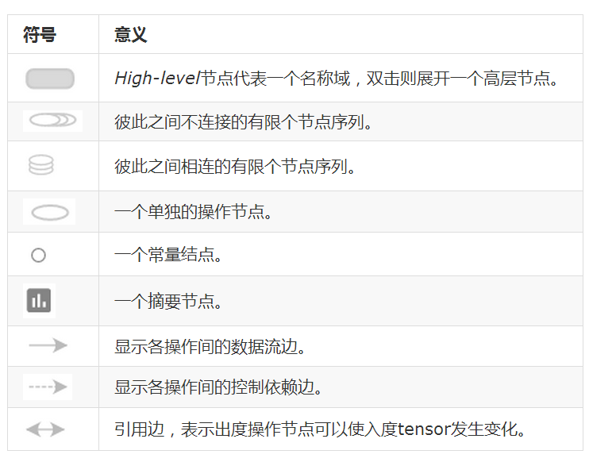

# `Tnesorboard`

## `Tensorboard`处理步骤

1. 创建图
2. 在想要可视化的结点处创建`summary.*`, 比如在使用`summary.scalar`添加学习率，损失等。使用`summary.histogram`添加权重与梯度,`summary.image`添加图像。
3. 将所有的summary汇总 `tf.merge_all_summaries`
4. 将汇总写入磁盘 `tf.train.Summarywriter`,`--logdir`可视化文件存放地址，`--GraphDef`x显示创建的图

```
merged_summary_op = tf.merge_all_summaries()
summary_writer = tf.train.SummaryWriter('/tmp/mnist_logs', sess.graph)
total_step = 0
while training:
  total_step += 1
  session.run(training_op)
  if total_step % 100 == 0:
    summary_str = session.run(merged_summary_op)
    summary_writer.add_summary(summary_str, total_step)

```

## 理论

### 名称域与节点

tensorflow由于节点太多，所以为了方便可视化需要划定变量名范围，并把这个范围内的节点定义到一个层级

```
import tensorflow as tf

with tf.name_scope('hidden') as scope:
  a = tf.constant(5, name='alpha')
  W = tf.Variable(tf.random_uniform([1, 2], -1.0, 1.0), name='weights')
  b = tf.Variable(tf.zeros([1]), name='biases')
```

可视化时，只显示`hidden`节点。双击后会显示里面隐藏的3各变量

可视化中有两种连接方式：

​	数据依赖：实心箭头表示

​	控制依赖：虚线箭头表示



如果两个high-level拥有相同的结构，则他们的颜色相同

还有一个视图展示了不同的操作运行于什么设备之上


## 启动TensorBoard

```
tensorboard --logdir=/path/to/log-directory
```

输入`localhost:6006`查看