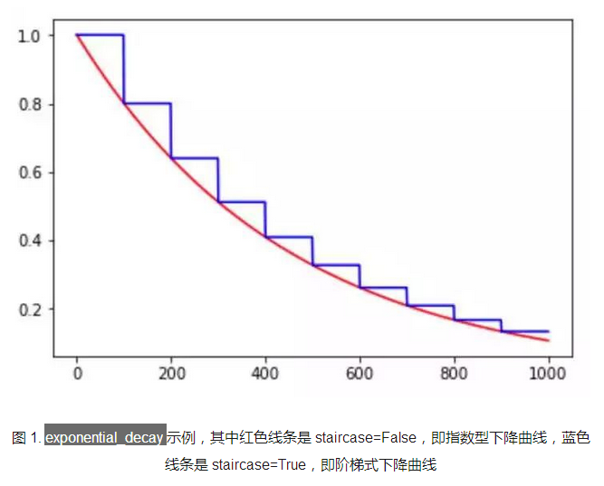
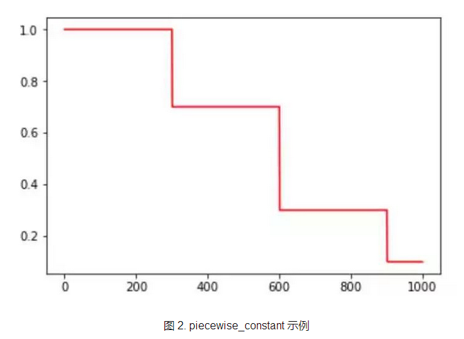
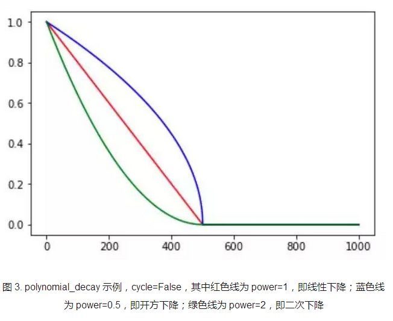
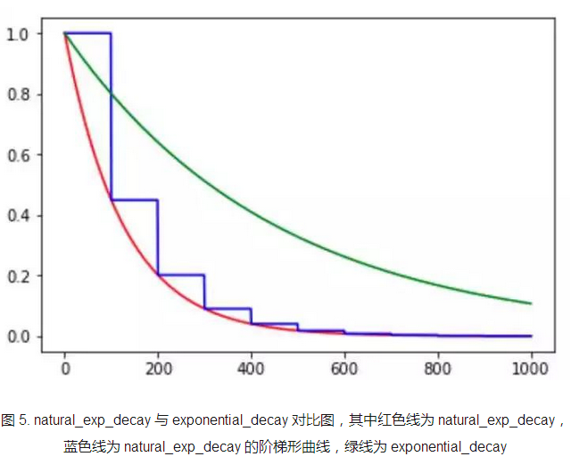
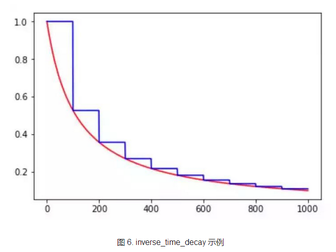
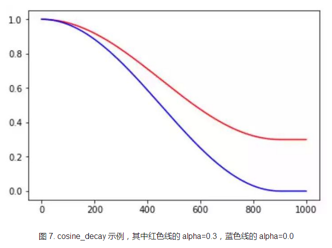
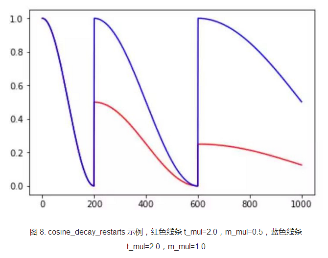
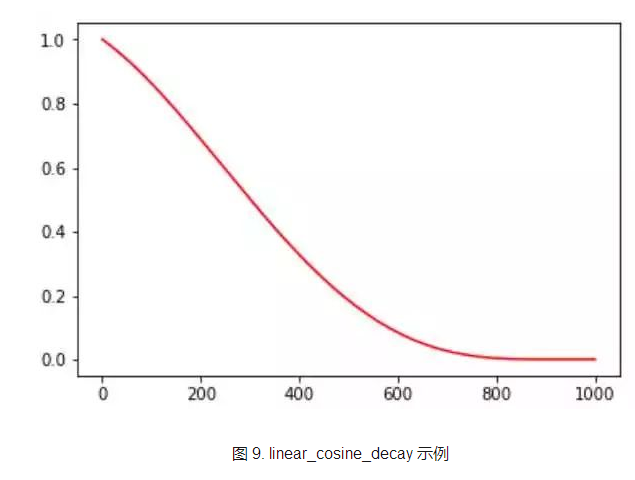

[参考](https://www.sohu.com/a/217389557_717210)

### `tf.train.exponential_decay`指数衰减

计算方法： 

learning_rate *   decay_rate ^ (global_step / decay_steps)

​	-- learning_rate

​	-- global_step #全局步数

​	-- decay_steps #衰减步数　

​	-- 衰减率

​	-- staircase # 如果是True,则    `global_step / decay_steps`是整数

 

### `tf.train.piecewise_constant(x, boundaries, values, name=None)`

分段常数下降法，类似于exponential_decay 中的阶梯式下降法，不过各阶段的值是自己设定的。 

其中，x 即为 global step，boundaries=[step_1, step_2, ..., step_n] 定义了在第几步进行 lr 衰减，values=[val_0, val_1, val_2, ..., val_n] 定义了 lr 的初始值和后续衰减时的具体取值。需要注意的是，values 应该比 boundaries 长一个维度 。

### `tf.train.polynomial_decay`

**以多项式的方式进行衰减学习率的**

计算方式：

---

global_step = min(global_step, decay_steps) 

decayed_learning_rate = (learning_rate - end_learning_rate) * (1 - global_step / decay_steps) ^ (power) + end_learning_rate

---

learning_rate, 

global_step,                                  	

decay_steps,

end_learning_rate=0.0001, 

power=1.0,

cycle=False,  # 用于决定学习率在下降后是否从新上升

name=None

### `tf.train.natural_exp_decay`

计算方法：与exponential_decay 差不多

decayed_learning_rate = learning_rate * exp(-decay_rate * global_step / decay_steps) 

### `tf.train.inverse_time_decay`

 倒数衰减：

decayed_learning_rate = learning_rate / (1 + decay_rate * global_step / decay_step) 

earning_rate, 

global_step,

 decay_steps, 

decay_rate,

 staircase=False,

 name=None 

### `tf.train.cosine_decay `

计算方法：

global_step = min(global_step, decay_steps)

cosine_decay = 0.5 * (1 + cos(pi * global_step / decay_steps))

decayed = (1 - alpha) * cosine_decay + alpha

decayed_learning_rate = learning_rate * decayed

---

learning_rate, 

global_step,

 decay_steps, 

alpha=0.0,  # 保证学习率不会低于某个值

name=None 

### `tf.train.cosine_decay_restarts`

learning_rate, 

global_step, 

first_decay_steps, # 表示第一完全下降的步数，达到这个步数以后开始执行第二次

t_mul=2.0,  # 后一次执行的步数 = 前一次 *  t_mul

m_mul=1.0, # 后一次的初始学习率 = 前一次 * m_mul

alpha=0.0, 

name=None

### `tf.train.linear_cosine_decay`

learning_rate, 

global_step,

 decay_steps,

 num_periods=0.5, 

alpha=0.0,

 beta=0.001,

 name=None 

主要用于增强学习

### `tf.train.linear_cosine_decay`

learning_rate, 

global_step,

 decay_steps,

initial_variance=1.0,

 variance_decay=0.55,

num_periods=0.5,

 alpha=0.0, 

beta=0.001,

name=None

该方法在衰减过程中加入了噪声，**某种程度上增加了 lr 寻找最优值的随机性和可能性。**

